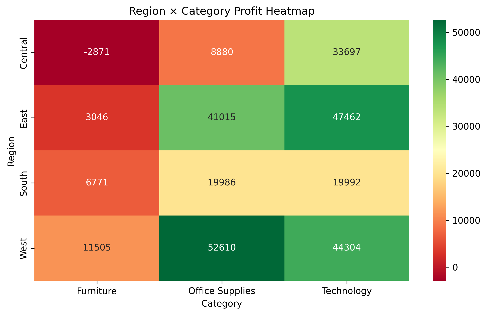
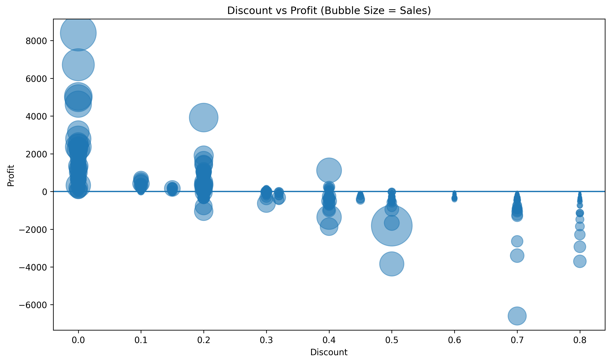
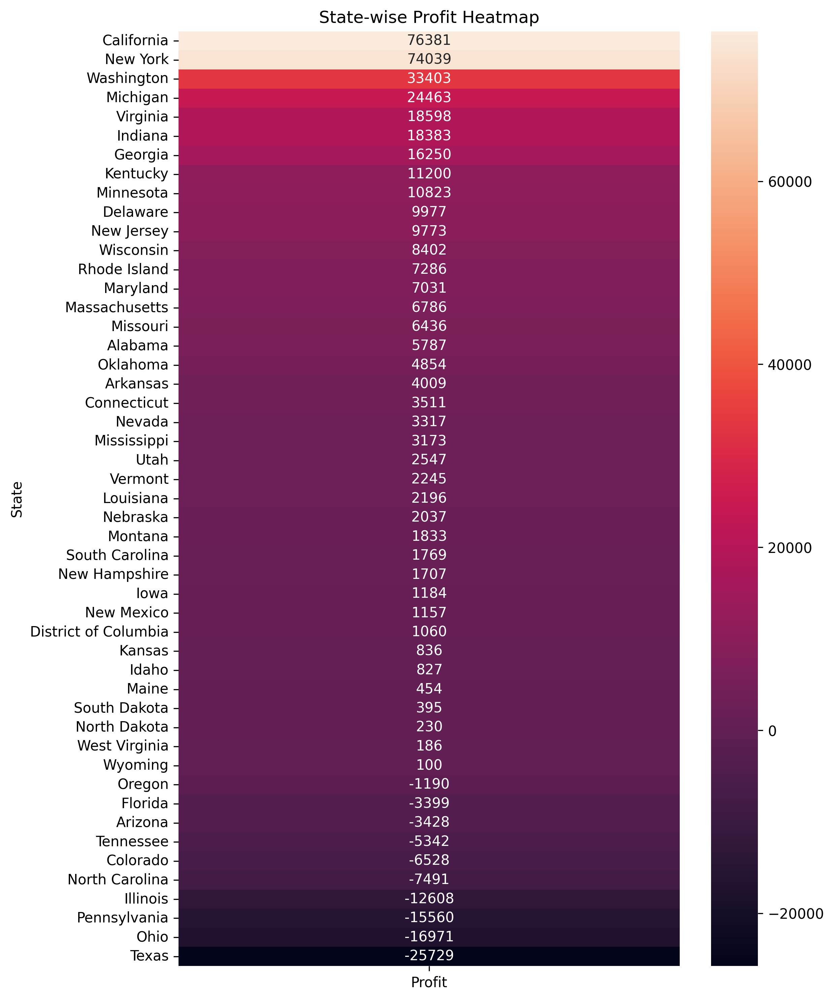
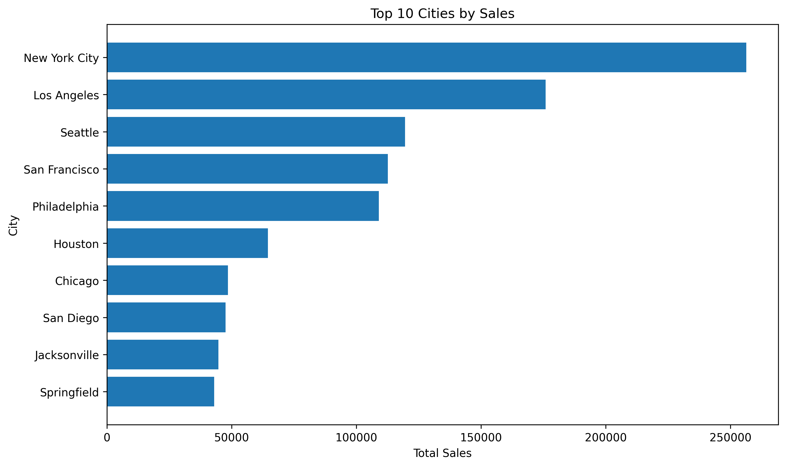

# Retail-Sales-Analytics
Business Intelligence &amp; Data Analytics Project using SQL Server, Python, Pandas, Seaborn,NumPy and Matplotlib.


# Retail Sales Analytics Project

## Project Overview

This project analyzes retail sales data from a US-based Superstore to uncover business insights related to sales performance, profitability, customer behavior, shipping preferences, and regional performance.

The objective was to simulate the role of a Business Intelligence Analyst by transforming raw transactional data into actionable business recommendations using SQL, Python, Pandas, NumPy, Matplotlib, and business storytelling techniques.

---

## Business Problem

Management wants to understand:

* Which regions, states, and cities drive the highest sales and profits?
* Which product categories and sub-categories perform best?
* How do discounts impact profitability?
* Which customer segments contribute the most profit?
* What shipping modes are most preferred by customers?
* Which areas of the business require strategic attention?

---

## Dataset Information

* Source: Sample Superstore Dataset
* Total Records: 9,994 transactions
* Time Period: Multiple years of retail sales data
* Data Cleaning: Duplicate records removed and data validated before analysis

Dataset contains:

* Orders
* Customers
* Products
* Sales
* Profit
* Discounts
* Shipping Information
* Geographic Information

---

## Tools & Technologies Used

* SQL Server
* Python
* Pandas
* NumPy
* Matplotlib
* Jupyter Notebook
* Microsoft PowerPoint
* Git & GitHub

---

## Key Performance Indicators (KPIs)

| KPI          | Value        |
| ------------ | ------------ |
| Total Sales  | ₹22.96 Lakhs |
| Total Profit | ₹2.86 Lakhs  |
| Total Orders | 9,977        |

---

## Business Questions Answered

### Sales & Profit Analysis

* Which states generate the highest profit?
* Which states generate losses?
* Which cities generate the highest sales?
* Which cities are loss-making?

### Product Performance

* Which category generates maximum sales and profit?
* Which sub-categories drive business growth?
* Which sub-categories underperform?

### Customer Analysis

* Which customer segment contributes the highest profit?
* What shipping mode is most preferred?

### Financial Analysis

* Does higher discount reduce profitability?
* Which region-category combinations are most profitable?

---

## Visualizations

### Region × Category Profit Heatmap



**Insight:** Technology consistently generates strong profits across regions, while some Furniture combinations underperform.

---

### Discount vs Profit Analysis



**Insight:** Higher discounts do not always increase profitability. Excessive discounting often reduces profit margins.

---

### State Profit Analysis



**Insight:** California and New York are the strongest profit-generating states, while Texas and Ohio show significant losses.

---

### Sales vs Profit by Sub-Category


)

**Insight:** Some sub-categories achieve high sales but generate relatively low profits, indicating pricing or cost optimization opportunities.

---

### Top 10 Cities by Sales



**Insight:** Major metropolitan cities contribute a significant share of company revenue.

---

## Key Business Insights

### Profit Leaders

* California generated the highest overall profit.
* New York remained one of the strongest contributors to profitability.
* Technology products delivered the best business performance.

### Areas of Concern

* Texas generated the largest loss.
* Several Furniture sub-categories showed weak profitability.
* Excessive discounting negatively affected margins.

### Customer Behavior

* Consumer segment generated the highest profit contribution.
* Standard Class was the most preferred shipping mode.

---

## Project Structure

```text
Retail-Sales-Analytics/
│
├── data/
│   └── SampleSuperstore.csv
│
├── images/
│   ├── discount_profit_bubble.png
│   ├── region_category_heatmap.png
│   ├── sales_profit_subcategory.png
│   ├── state_profit_heatmap.png
│   └── top10_cities_sales.png
│
├── notebooks/
│   └── sales_analysis.ipynb
│
├── presentation/
│   └── project.pptx
│
├── sql/
│   └── business_queries.sql
│
└── README.md
```

---

## Skills Demonstrated

* SQL Query Writing
* Business KPI Analysis
* Data Cleaning
* Exploratory Data Analysis (EDA)
* Data Visualization
* Business Storytelling
* Profitability Analysis
* GitHub Project Documentation

---

## Future Improvements

* Interactive Power BI Dashboard
* Customer Segmentation Analysis
* Cohort Analysis
* Sales Forecasting
* Automated Reporting Pipeline

---

## Author

**Kavya**

B.Tech Computer Science Student

Aspiring Data Analyst | SQL | Python | Excel | Power BI
